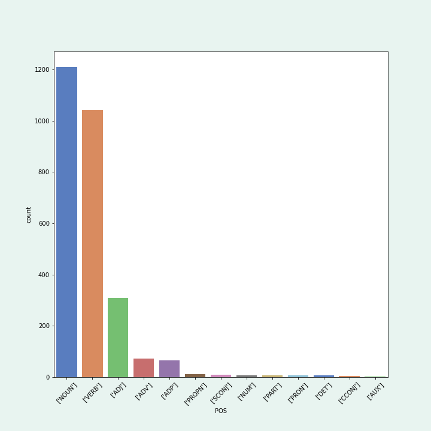
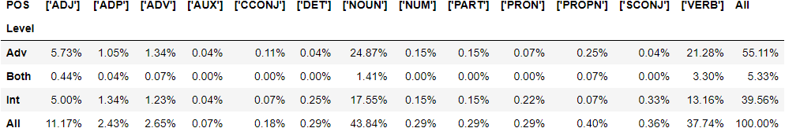
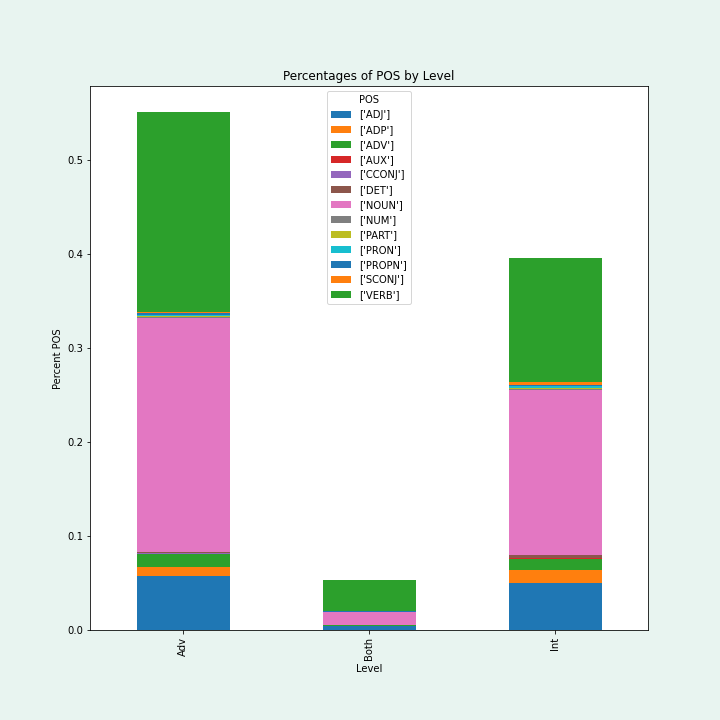
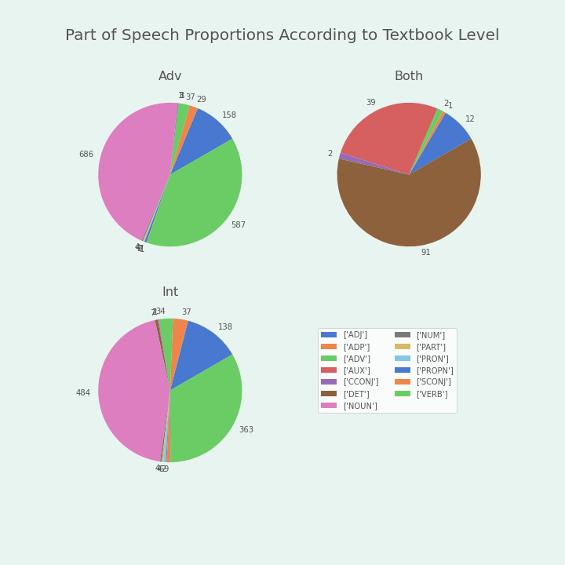

# 1. Introduction
The current project stemmed from a desire to explore Russian L2 learner data or pedagogical materials using computational methods. Initially, I had hoped to find or develop a corpus of Russian Learner texts, similar to the ELI we had explored both in this class as well as Introduction to Computational Linguistics, in order to conduct research similar to Dr. Ben Naismith’s work on English L2 learner data. My colleague from the Slavic Department, Dr. Olga Klimova had originally reached out to a handful of us Slavic-oriented linguistics students to try to develop the skills and learn about the methods necessary to carry out such a task.
I quickly learned that developing a learner corpus went far beyond the scope of a term project. While creating a learner corpus from scratch did not pan out, I was reminded of conversations Dr. Klimova and I had had before regarding the role of pedagogical materials in the communicative language classroom. Rather than focus on production data create a hypothesis-driven study, I decided to focus instead on honing my computational skills to explore existing vocabulary data.

# 2. Background
Lewis (1993) describes Language as “consist[ing] of grammaticalized lexis, not lexicalized grammar.” With this in mind, word knowledge has been explored in multiple dimensions, e.g. breadth and depth. Vocabulary breadth refers to the number of words a person knows, while depth refers to the greater knowledge of a word based on its connection to similar words (like wordnet conceptual semantics). Although scholars had previously found limited value in studying vocabulary breadth, Vermeer (1993) found that for both L1 and L2 child-speakers of Dutch vocabulary breadth and depth (as connected dimensions) were both strongly correlated to frequency of the Vocabulary in the input. Therefore, word knowledge is a function of the frequencies of the networks of word connections.

Despite what may be known about the roll of frequency and lexical acquisition, pedagogical approaches and materials can ignore the role of lexis in proficiency and language acquisition. Meaning that the role of vocabulary in language acquisition has been largely underexplored. Structuralist and communicative approaches do not consider the role of lexis in overall linguistic development (Milton and Alexiou, 2012). Indeed, oral interaction and authentic materials are essential for successful communicative teaching; however, Milton (2010) and Schmitt, Jiang and Grabe (2011) found the current syllabuses, materials and methods are lexically deficient.

As echoed in Lipinski (2010) lexical frequency is a useful guideline for selecting and sequencing vocabulary because a relatively low number of words is needed to cover a large portion of written and spoken texts. Nation (1990) found that the 4-5,000 most frequent English words cover 95% of written and 85% of oral texts. A future version of my current project would seek to find the text coverage of lexical frequency bands for Russian to provide a baseline of textbook comparison, following Lipinski’s methodology. However, my project expands on the Lipinski’s work, by allowing for multiword units and targeted vocabulary glossaries to be analyzed through the development of a computational pipeline that can produce an expanded lemmatized token list from a plain text copy of a digitized textbook.

# 3. Data Sourcing
The data I transformed were obtained from Dr. Olga Klimova who provided me PDF versions of the textbooks Russian: From Intermediate to Advanced (Kagan, Kudyma and Miller, 2015) and Russian: From Novice High to Intermediate (Kudyma, 2021). The glossary pages were copied to the notepad application and saved as plain text.

# 4. Data Cleanup
-	Rough cleaning

Git Bash command line and grep with regular expressions were used to catch and repeated unnecessary lines. Because the data were textbook pages this included page numbers and headers that declared the section a Russian-English/English-Russian glossary. Both textbooks contained extraneous grammatical/meta-linguistic information (verb case usage, irregular conjugations, common collocations, etc). In the rough cleaning phase, only that meta-linguistic information that was given a separate line (tense/conjugation information in the intermediate textbook) were removed and the resulting versions were saved for further cleaning and manipulation.

-	[Data Processing](https://nbviewer.org/github/Data-Science-for-Linguists-2022/Textbook_Vocab_Analysis/blob/main/Processed_Data.ipynb#1-Importing-libraries-and-packages)

First, I import all of the packages and libraries I will need: pandas for creating and manipulating data frames, regular expressions to target and replace particular strings for fine-tuned cleaning, spacy for their natural language processing models, matplotlib and seaborn for visualizations, and a dataframe image-maker to output some tables as .png images.

-	[Reading in and Parsing the Data](https://nbviewer.org/github/Data-Science-for-Linguists-2022/Textbook_Vocab_Analysis/blob/main/Processed_Data.ipynb#2.-Reading-in-and-Parsing-the-Data)

Here I read in the plain text data and parse it into a data frame object. Reading in each textbook and flashing a few thousand characters pretty quickly shows the format of the data. Each is a continuous string object consisting of a Russian word or entry, some additional grammatical information, the page(s) the entry appears on, a hyphen and the English translation.
Entries were split on the new-line character, and all lines were switched to lower case using list comprehension. A regular expression string was used to capture one or more comma-separated page numbers, replacing them with a white space. The list was then transformed into a pandas data frame with the starting column “Entry” resulting in a dataframe the sole array of which exists as a list of hyphen separated Russian entries and English translations. Each entry was then split along the hyphen character and expanded into two new columns “Russian” and “English” containing their respective part of the full entry.

  Each plain text file had been manually edited, such that all extra grammatical information was set apart from the primary vocabulary items and collocations by parentheses. This was the case for the majority of the data already. Regular expressions and data frame manipulation were used to extract this grammatical information into its own column “Extra” and removed from the “Russian” column. Accented characters were replaced with unaccented characters, a level value of “Int” for intermediate and “Adv” for advanced were broadcast to each data frame, and then they were joined together and sorted by the Russian column values. This resulted in a data frame with 2119 non-null entries. However, a Russian entry could still be a collocation which would make further tagging and analysis problematic.

-	[Manipulating the Russian Entries](https://nbviewer.org/github/Data-Science-for-Linguists-2022/Textbook_Vocab_Analysis/blob/main/Processed_Data.ipynb#3.-String-Manipulation)

Multi-word Russian entries were split on slashes, tildes, and commas then exploded into new rows, duplicating the information associated with the full entry in other columns. These strings were then stripped. A function was defined to get the lemmas for a string of words using SpaCy’s nlp model for Russian. Lemma lists were extracted into their own column, split on commas and exploded into individual rows of lemmas, duplicating information from the other columns. A function was defined to tag a string of tokens or lemmas with part of speech information from the SpaCy Russian model. The function was run on the lemma array to return part of speech tags which were then extracted into their own column. Duplicate lines were dropped, then any lines that were tagged for white space or punctuation as part of speech were dropped. This resulted in a final lemmatized and tagged Russian token data frame of 2972 unique tokens from the two textbooks.

# 5. Analysis
- [Some descriptive analysis](https://nbviewer.org/github/Data-Science-for-Linguists-2022/Textbook_Vocab_Analysis/blob/main/Processed_Data.ipynb#4.-Some-Descriptive-Analysis)

After condensing duplicate entries that appear in both textbooks into a third “Both” level, some descriptive statistics and visualizations were made. Of the total 2,757 unique tokens the majority come from the Advanced textbook (1,519) followed by the Intermediate textbook (1,091) and 147 tokens were shared across textbooks. Meaning that the whole dataset is 55% advanced textbook tokens 40% intermediate tokens and the textbooks share 5% of all of their tokens.

The included visualizations show the overall breakdown of POS in total and across levels. Nouns and verbs make up the vast majority of tokens, followed by adjectives. It makes sense for these categories to be the largest because they are open grammatical categories that carry meaning. Other POS type groups are going to be much smaller because they are more closed categories like pronouns, determiners, conjunctions, particles, etc.

Here's a pivot table of the breakdown of POS by level and then both a stacked bar chart and some pie charts of those proportions. Not that the 'Both' pie chart is wrongly colored and I don't know why

# 6. Conclusion
Over all, I’m really happy with the outcome of my project. Granted things moved very slowly due to personal issues and stressors. Had I gotten to the place I am now a few weeks ago, I’m sure I would have been able to implement a frequency band comparison component that would speak more directly to the research questions that I had set out with. Going a year without keeping up with computational linguistics methods made jumping back in much more difficult and so much of it remained unintuitive. That being said, I do feel well prepared to search for references and similar cases and really do think that I have created a relatively succinct pipeline for dealing with digitized textbook data. This would really streamline future research on targeted vocabulary analysis. For now, my project acts mostly as a proof of concept. In the future I would research Russian frequency dictionaries and try to find a lemmatized version to make comparisons valid. I could lemmatize the inflected sketch engine frequency corpus, but I am skeptical about what those frequency values would map to. This was a labor of love and I’m grateful to be finished.

# 7. references

1.	James Milton & Thomaï Alexiou (2012) Vocabulary input, vocabulary uptake and approaches to language teaching, The Language Learning Journal, 40:1, 1-5, DOI: 10.1080/09571736.2012.658218
2.	Lewis, M. (1993). The lexical approach: The state of ELT and a way forward. Hove: Language Teaching Publications
3.	Lipinski, S. (2010). A Frequency Analysis of Vocabulary in Three First-Year Textbooks of German. Die Unterrichtspraxis / Teaching German, 43(2), 167–174. http://www.jstor.org/stable/40961806
4.	Nation, I.S.P. (1990) Teaching and Learning Vocabulary. Newbury House, New York.
5.	Milton, J. 2010a. The role of classroom and informal vocabulary input in growing a foreign language lexicon. Journal of Applied Linguistics, 27: 59–80.
6.	Schmitt, N., Jiang, X. and Grabe, W. 2011. The percentage of words known in a text and reading comprehension. The Modern Language Journal, 95(1): 26–43.
7.	Vermeer, A. (2001). Breadth and depth of vocabulary in relation to L1/L2 acquisition and frequency of input. Applied Psycholinguistics, 22(2), 217-234. doi:10.1017/S0142716401002041
